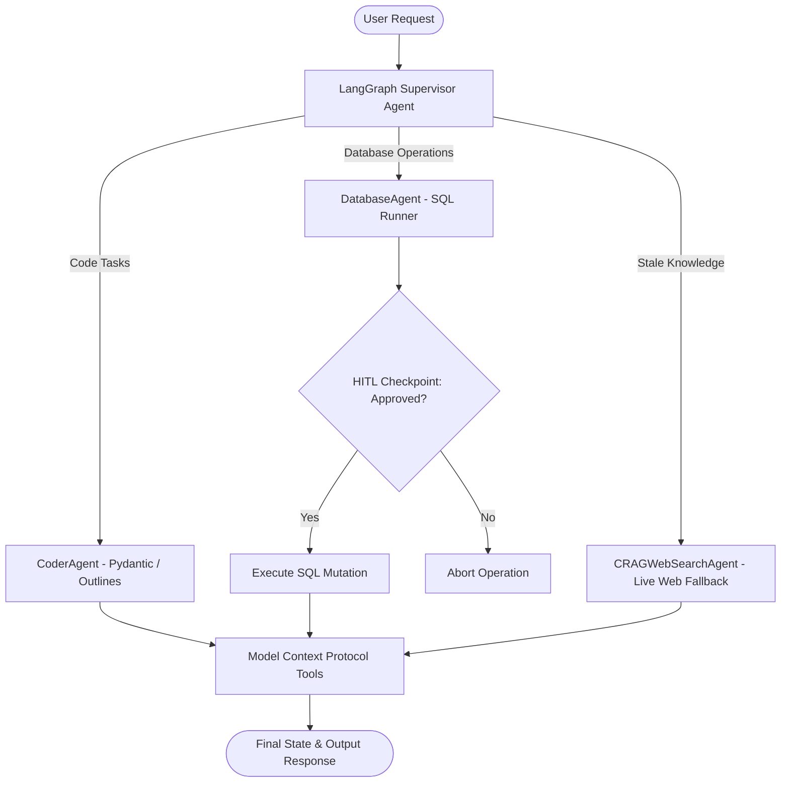

# 🚀 Multi-Agent Autonomous AI Workflow System via LangGraph & MCP

[](https://www.python.org/)
[](https://github.com/langchain-ai/langgraph)
[](https://modelcontextprotocol.io)
[](https://fastapi.tiangolo.com/)

An enterprise-grade **Autonomous Multi-Agent System** engineered using **LangGraph Supervisor StateMachine Architecture**, **Model Context Protocol (MCP)** as a universal tool connector, and **Corrective RAG (CRAG)** web search fallback for stale domain knowledge.

---

## 🎯 Key Architectural Pillars

### 1. Supervisor-Agent State Machine (LangGraph)
- Coordinates specialized domain agents: **CoderAgent**, **DatabaseAgent**, and **CRAGWebSearchAgent**.
- Preserves **Stateful Persistent Memory** across multi-turn autonomous execution loops.

### 2. Human-in-the-Loop (HITL) Approval Gates
- Interrupts execution automatically before critical database mutations or financial/write operations.
- Requires explicit user approval before proceeding to state execution.

### 3. Corrective RAG (CRAG) Web Search Fallback
- Evaluates document retrieval confidence dynamically.
- Triggers live web search fallback when knowledge freshness falls below confidence thresholds ($< 0.70$).

### 4. Model Context Protocol (MCP) Integration
- Standardized tool integration protocol allowing agents to discover and invoke tools (`code_executor`, `sql_runner`, `web_search`) seamlessly.

---

## 📐 Architecture Workflow



---

## 📁 Repository Structure

```
multi_agent_langgraph_mcp/
├── config/
│   └── agent_config.json       # Supervisor & Agent MCP Configurations
├── src/
│   ├── __init__.py
│   ├── supervisor_state.py     # LangGraph AgentState Memory Schema
│   ├── agents.py               # Coder, Database & CRAG Agents
│   ├── mcp_tools.py            # Model Context Protocol (MCP) Tools
│   ├── graph_workflow.py       # LangGraph StateGraph Supervisor Machine
│   └── server.py               # FastAPI Execution REST API
├── tests/
│   └── test_multi_agent.py     # Verification & Benchmark Suite
├── requirements.txt            # Dependencies
└── README.md                   # Documentation
```

---

## ⚡ Quick Start

### 1. Install Dependencies
```bash
pip install -r requirements.txt
```

### 2. Run Verification Test Suite
```bash
python tests/test_multi_agent.py
```

### 3. Launch FastAPI Workflow API
```bash
uvicorn src.server:app --reload --port 8000
```
Visit [http://localhost:8000/docs](http://localhost:8000/docs) to test `/execute-workflow` endpoints.

---

## 📊 Features & Performance Summary

| Feature | Standard LLM Chain | LangGraph Multi-Agent + MCP (This Project) | Benefit |
|---|---|---|---|
| **State Management** | Stateless / Single-turn | Persistent Stateful Checkpoints | **Multi-Turn Memory** |
| **Tool Integration** | Hardcoded Functions | Model Context Protocol (MCP) | **Universal Standard** |
| **Write Protection** | Unrestricted Execution | Human-in-the-Loop (HITL) Checkpoint | **Zero Accidental Writes** |
| **Knowledge Fallback** | Static Hallucination | Corrective RAG (CRAG) Web Search | **Real-time Knowledge** |

---

## 👤 Author & Architecture Lead
* **Rakesh Kumar Bhol** — Senior AI Architect & GenAI Engineer
* LinkedIn: [linkedin.com/in/rakeshbhol](https://linkedin.com/in/rakeshbhol)
* Email: [rakeshbhol1995@gmail.com](mailto:rakeshbhol1995@gmail.com)
